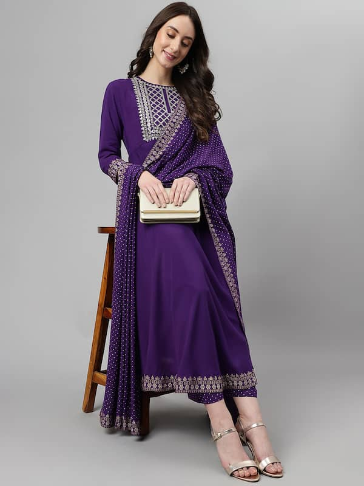
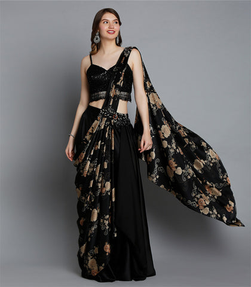
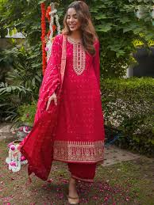
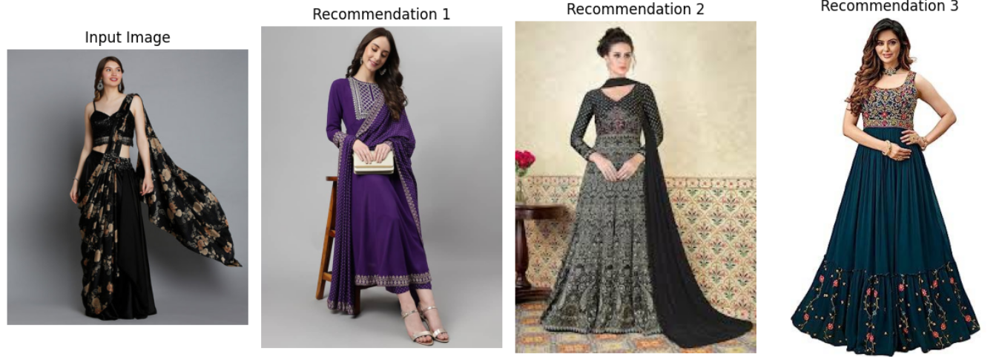

# 👗 Fashion Recommendation System with Image Features 👘

## 🌟 Overview of the Project: 

A Fashion Recommendation System with Image Features uses computer vision and machine learning techniques to assess the visual elements of fashion goods (such as color, texture, and style) and propose comparable or complimentary products to customers. 🎯

## 🚀 Steps:

1. 📁 Assemble a diverse dataset of fashion items. This dataset should include a wide variety of items with different colors, patterns, styles, and categories.

2. 🖼️ Ensure all images are in a consistent format (e.g., JPEG, PNG) and resolution.

3. 🔧 Implement a preprocessing function to prepare images for feature extraction.

4. 🧠 Choose a pre-trained CNN model such as VGG16, ResNet, or InceptionV3. These models, pre-trained on large datasets like ImageNet, are capable of extracting powerful feature representations from images.

5. 🔍 Pass each image through the CNN model to extract features. Define a metric for measuring the similarity between feature vectors.

6. 🏆 Rank the dataset images based on their similarity to the input image and recommend the top N items that are most similar.

7. 🎉 Implement a final function that encapsulates the entire process from pre-processing an input image, extracting features, computing similarities, and outputting recommendations.

## Dataset:
- You can download the entire dataset regarding to this project as zip file from [Dataset](https://statso.io/fashion-recommendations-using-image-features-case-study/)

## 📸 Sample Images:

  
  
  

## 🛠️ Libraries/Packages:

- os
- matplotlib
- glob
- tensorflow
- scipy

## 🌟 Results:

## 📫 Contact:

For any queries or suggestions, feel free to reach out to me at [nithishpaidimarri@gmail.com](mailto:nithishpaidimarri@gmail.com).
